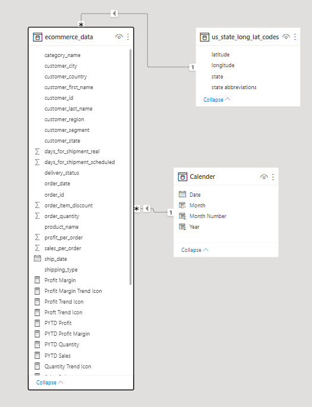
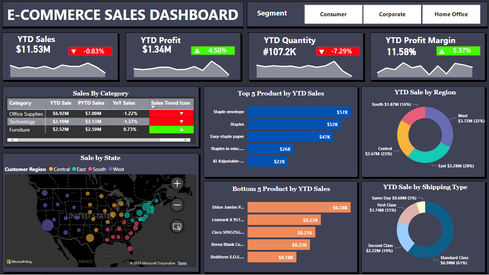

# E-Commerce Data Analysis

## Introduction 
This is a Power BI project focusing on sales analysis for an e-commerce company. The goal is to analyze and derive insights to answer critical questions and enable data-driven decision-making.

**_Disclaimer_**: All datasets and reports used in this project are purely fictitious and do not represent any real company, institution, or country. They are solely for demonstration purposes to showcase the capabilities of Power BI. The datasets were taken from the YouTube Channel titled "Data Tutorials" (link: https://www.youtube.com/watch?v=-TErGczFxUs), and data analysis was performed using the tutorial for learning purposes. However, to add my own touch to the dashboard, I have made some visual and new measure calculation modifications.  

## Requirements
A US-based E-commerce Sales Company has requested us to create a Sales Dashboard displaying YTD sales information and generating insights for the following scenarios:

1. Create a KPI Banner showing YTD Sales, YTD Profit, YTD Quantity sold, and YTD Profit Margin.
2. Calculate Year-on-Year growth for each KPI and include a YTD sparkline for each measure in the KPI to visualize the monthly trend.
3. Determine YTD Sales, Prior Year YTD Sales (PYTD), and Year-on-Year Sales growth for different customer categories. Add a trend icon for each category.
4. Analyze YTD Sales performance for each State.
5. Identify the Top 5 and Bottom 5 Products by Sales.
6. Analyze YTD Sales by Region to understand the best and worst-performing regions across the country.
7. Explore YTD Sales by Shipping Type to determine the percentage of the best shipping types.

## Skills/Concepts Demonstrated 🤓
 The following Power Bi features were incorporated:
 - DAX
 - Measures
 - Modelling
 - Filters and etc.

## Modelling

A separate calendar table was created. Adding a separate date table in Power BI data modeling is essential for efficient time-based analysis. It enables optimised time intelligence functions, custom hierarchies, and consistent date values across multiple data tables. The dedicated date table simplifies time-based calculations, enhances visualizations, and improves overall data analysis and reporting processes.

## E-Commerce Sales Dashboard

Analysis 😃:
1. The Year To Date Sales is $11.53 million, which is -0.83% less compared to the previous year. However, the Year To Date Quantity is 107.2K, while the Year To Date Profit is $1.34 million, representing a 4.50% increase from the previous year. This growth is due to the Year On Year Profit Margin, which has increased by 5.37% compared to the previous year, resulting in a Year To Date Profit Margin of 11.58%.
   
2. According to Sales By Category, only the furniture product category has generated greater sales revenue than the previous year, reaching $2.52 million. This is just slightly more by $0.02 million (0.73% increase) compared to product categories such as office supplies and technology, both with over 1% decrease.

3. The top 5 products by YTD sales are staple envelope, staples, easy-staple paper, staples in misc.colors, and KI adjustable-height table.

4. The bottom 5 products by YTD sales are Eldon jumbo profile portable file boxes, Lexmark x9575 printer, Cisco Spa525G2 phone, Xerox blank computer paper, and Rediform s.o.s message book.

5. Year To Date Sales by Region, ranked from highest to lowest, are West with 32%, East with 28%, Central with 23%, and South with 16%.

6. Year To Date Sales by Shipping Types, ranked from highest to lowest, are standard class with 61%, second class with 19%, first class with 15%, and same day with 5%.

   
   

